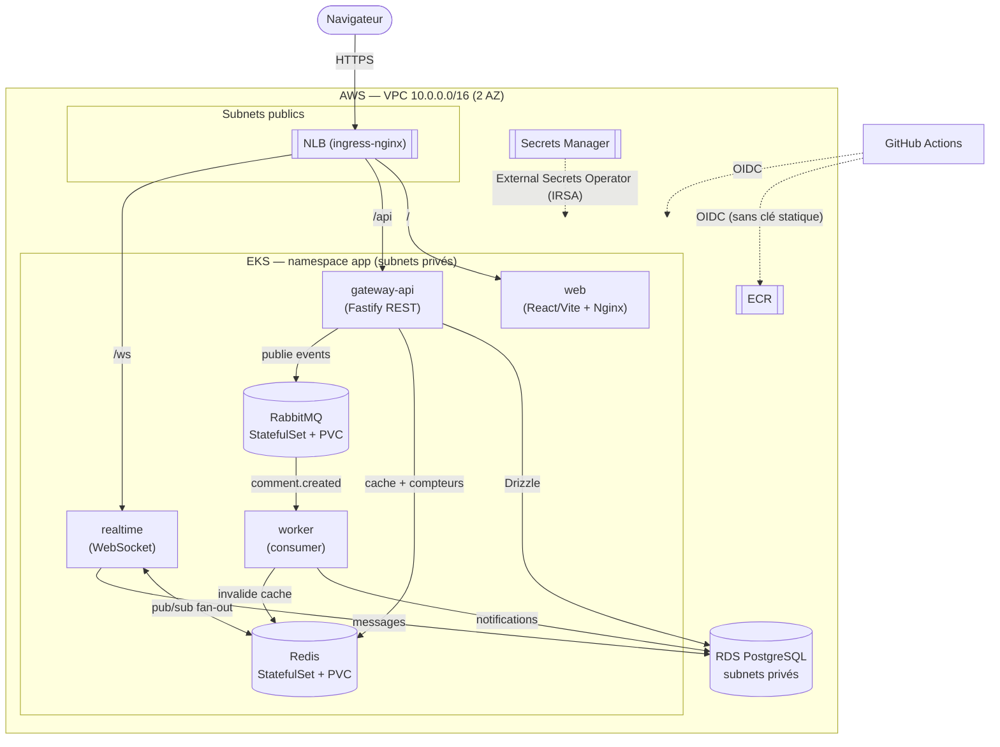

# m2cloud — « Hearth » : plateforme de discussion microservices sur AWS EKS

> Application type Reddit avec **chat en temps réel** (rooms, threads, commentaires, votes, chat live), construite en **microservices** Node/TypeScript, déployée sur **AWS EKS** avec **Infrastructure-as-Code (Terraform)** et **CI/CD GitHub Actions**.
>
> Stack imposée : **PostgreSQL**, **Redis**, **RabbitMQ**, **Kubernetes**. Monorepo.

---

## 1. Schéma d'architecture global



Diagramme source : [`diagrams/architecture.mmd`](diagrams/architecture.mmd).

**Flux applicatifs** : le navigateur passe par un **NLB AWS** → **ingress-nginx**, qui route `/` vers le frontend, `/api` vers l'API REST, `/ws` vers le service temps réel. L'API écrit dans **RDS** (Drizzle), met en cache et incrémente les votes dans **Redis**, et **publie des événements** dans **RabbitMQ**. Le **worker** consomme ces événements pour créer des notifications de façon asynchrone. Le **chat live** utilise **Redis pub/sub** pour diffuser les messages entre les réplicas WebSocket.

**Sécurité / réseau / IAM** : RDS est dans des **subnets privés** (Security Group ouvert uniquement depuis les nœuds EKS). Les secrets viennent de **Secrets Manager**, injectés par l'**External Secrets Operator** via **IRSA** (rôle IAM porté par un ServiceAccount, sans clé statique). La CI/CD s'authentifie à AWS par **OIDC GitHub** (aucune access key stockée).

---

## 2. Services (microservices)

| Service | Rôle | Données | Scaling |
|---|---|---|---|
| **gateway-api** | REST : auth (JWT/bcrypt), rooms, posts, commentaires, votes ; producteur d'events | PostgreSQL (Drizzle), cache Redis | HPA CPU 2→6 |
| **realtime** | Chat WebSocket par room, fan-out multi-réplica | Redis pub/sub, écrit les messages en PG | HPA, connexions longues |
| **worker** | Consomme RabbitMQ → notifications, invalide le cache | RabbitMQ, PostgreSQL, Redis | réplicas fixes (KEDA possible) |
| **web** | SPA React/Vite servie par Nginx | gateway (REST), realtime (WS) | HPA |

Packages partagés du monorepo : `@m2cloud/shared` (logger JSON, config zod, contrat d'events typé, JWT, métriques) et `@m2cloud/db` (schéma **Drizzle** + migrations).

---

## 3. Justification des choix techniques

| Décision | Alternative écartée | Justification |
|---|---|---|
| **Kubernetes / EKS** | Serverless (Lambda + API Gateway) | Les connexions WebSocket longues et les workers stateful s'orchestrent mal en serverless. EKS = scaling fin (HPA), portabilité, démonstration de la maîtrise infra. |
| **RDS PostgreSQL + Drizzle** | Blob/S3, DynamoDB | Données fortement **relationnelles** (users/posts/comments/votes, unicité, jointures). S3 = objets non structurés, inadapté. Drizzle = ORM TypeScript typé + migrations versionnées. |
| **Redis in-cluster** | ElastiCache | Cache + **pub/sub temps réel** ; en cluster = coût réduit et démontre **StatefulSet/PVC** (persistance K8s). |
| **RabbitMQ in-cluster** | Amazon MQ / SQS | Découplage **event-driven** typé (exchange topic) ; en cluster = coût réduit + persistance PVC. SQS = vendor-lock et routage limité. |
| **Monorepo pnpm** | Multi-repos | Contrats/types partagés (`packages/shared`), CI unifiée, changements atomiques. |
| **GitHub OIDC** | Access keys en secret CI | Aucun credential long-terme stocké → surface d'attaque réduite. |
| **ESO + IRSA** | Secrets en clair / variables CI | Secrets centralisés, rotation possible, accès IAM finement délimité. |
| **ingress-nginx (NLB)** | AWS ALB Controller | Plus simple à câbler, WebSocket natif, robuste. |
| **Bundle tsup + `pnpm deploy`** | Image avec tout le monorepo | Images runtime minuscules (un `dist/index.js` + node_modules de prod uniquement). |

---

## 4. Sécurité & gestion des secrets

- **Aucun secret dans le code** : tout vient de Secrets Manager (`m2cloud/app` : `DATABASE_URL`, `JWT_SECRET`, `RABBITMQ_URL`) → synchronisé en `Secret` Kubernetes par l'**External Secrets Operator**. Seul `.env.example` est versionné.
- **CI/CD sans clé AWS statique** : **OIDC GitHub** → la pipeline *assume* un rôle IAM (`m2cloud-gha`) à l'exécution.
- **IAM least-privilege** :
  - rôle CI : `ecr:*` (push, scoped aux repos m2cloud) + `eks:DescribeCluster` uniquement ;
  - rôle ESO (IRSA) : `secretsmanager:GetSecretValue` sur **le seul** secret `m2cloud/app` ;
  - workloads via **IRSA** ; **jamais** le compte root pour les workloads.
- **Réseau** : RDS dans des subnets privés ; Security Group n'autorisant Postgres que depuis le SG des nœuds EKS.

> ⚠️ Le compte AWS utilisé pour `terraform apply` doit être un **utilisateur/rôle IAM dédié** (pas le compte root). Voir §6.

---

## 5. Scalabilité & résilience

- **Scalabilité** : `HorizontalPodAutoscaler` (CPU 70 %, 2→6) sur gateway-api et realtime ; services stateless multi-réplicas ; node group EKS extensible (Cluster Autoscaler / Karpenter documentés en évolution).
- **Résilience** : probes `liveness`/`readiness` sur tous les services ; `PodDisruptionBudget` (minAvailable 1) ; **persistance** via PVC (Redis/RabbitMQ) + backups RDS (7 j) ; subnets multi-AZ ; RDS Multi-AZ activable (`-var rds_multi_az=true`).
- **Observabilité** : logs JSON structurés (stdout → CloudWatch) ; endpoints `/health`, `/ready`, `/metrics` (Prometheus-ready) sur chaque service.

---

## 6. Démarrage

### Local (docker-compose) — démo complète sans AWS

```bash
pnpm install
docker compose up -d postgres redis rabbitmq      # PG + Redis + RabbitMQ
cp .env.example .env
pnpm db:migrate                                    # crée les 7 tables
pnpm -r build                                      # bundle les services
bash scripts/smoke-local.sh                        # e2e : REST + notif async + chat WS
# ou en dev :
pnpm dev                                           # tous les services en watch
```

### AWS (EKS réel)

```bash
# 0. (Recommandé) créer un user/role IAM dédié pour Terraform, ne pas utiliser root.
# 1. Backend d'état distant
bash scripts/bootstrap-tf-backend.sh
# 2. Provisionner VPC + EKS + RDS + ECR + IAM/OIDC + Secrets (~20 min)
cd infra/terraform && terraform init && terraform apply
aws eks update-kubeconfig --name m2cloud --region eu-west-1
# 3. Plateforme : Redis, RabbitMQ, ingress-nginx, External Secrets (voir infra/k8s/helm-values)
# 4. Build & push images vers ECR, déployer via Kustomize (automatisé par GitHub Actions, cf. §7)
# 5. Démo terminée → tout détruire pour stopper les coûts :
bash scripts/teardown.sh
```

---

## 7. CI/CD (GitHub Actions)

| Workflow | Déclencheur | Rôle |
|---|---|---|
| [`ci.yml`](.github/workflows/ci.yml) | PR / push | install → typecheck → tests (PG en service) → build web |
| [`cd.yml`](.github/workflows/cd.yml) | push `main` | OIDC AWS → build & push images ECR (tag = SHA) → `kubectl apply -k` sur EKS |
| [`infra.yml`](.github/workflows/infra.yml) | PR sur `infra/terraform/**` | `terraform fmt` + `validate` |

Variables de dépôt à définir : `AWS_ROLE_ARN` (sortie Terraform `gha_role_arn`).

---

## 8. Structure du dépôt

```
apps/{gateway-api,realtime,worker,web}   # microservices
packages/{shared,db}                     # contrat partagé + schéma Drizzle
infra/terraform/                         # IaC AWS (VPC, EKS, RDS, ECR, IAM, Secrets)
infra/k8s/{base,overlays,helm-values}    # Kustomize + valeurs Helm + External Secrets
docker/                                  # Dockerfiles (services + nginx)
.github/workflows/                       # ci, cd, infra
scripts/                                 # bootstrap backend, smoke e2e, teardown
diagrams/                                # schéma d'architecture
```

---

## 9. Tests

44 tests (vitest) : `@m2cloud/shared` (3), gateway-api (30, dont auth/votes/cache/events), realtime (7, pub/sub + WS), worker (4, notifications). E2E complet via `scripts/smoke-local.sh`.

```bash
pnpm -r typecheck && pnpm -r test
```
