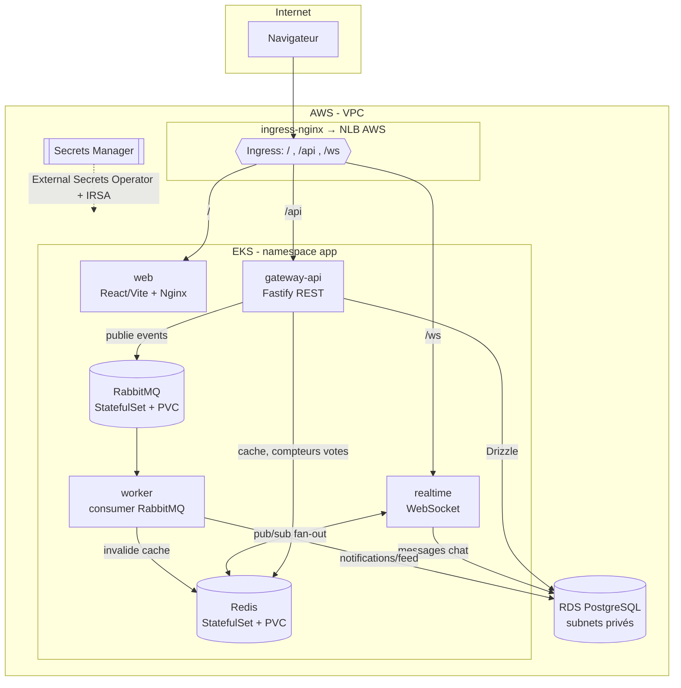

# Design — m2cloud / "Hearth" : plateforme de discussion microservices sur AWS EKS

- **Date** : 2026-06-24
- **Statut** : Validé (brainstorming) — en attente de revue spec avant plan d'implémentation
- **Auteur** : na2sime
- **Contexte** : devoir M2 Cloud — note sur 40 (Architecture & Conception Cloud /20 + Implémentation, Sécurité & Déploiement /20)

---

## 1. Contexte & objectifs

Construire une petite application **microservices** type Reddit avec **chat live**, déployée sur une **vraie infrastructure cloud AWS** pilotée **100 % en Infrastructure-as-Code**, avec **CI/CD GitHub**. Contraintes imposées : **Postgres**, **Redis**, **RabbitMQ**, **Kubernetes obligatoire**, **monorepo**.

La note porte à ~100 % sur l'**infrastructure / architecture / sécurité / CI-CD**, *pas* sur la richesse fonctionnelle. L'application est donc volontairement **mince mais cohérente** : juste assez pour justifier *naturellement* l'usage de Postgres + Redis + RabbitMQ et de plusieurs microservices aux profils de scaling différents.

### Décisions de cadrage (validées)
| Axe | Choix retenu |
|---|---|
| Où tourne K8s | **EKS réel sur AWS** (max de points "infra déployée"), teardown après démo |
| Données | **Mixte** : Postgres en **RDS managé**, Redis + RabbitMQ **in-cluster** (StatefulSets/PVC) |
| Stack app | **Node.js + TypeScript**, monorepo pnpm workspaces, **Fastify** |
| Auth | **JWT complet** (register/login, hash bcrypt) |
| CI/CD + Observabilité | **Pipeline complet** + **observabilité légère** (logs structurés + /metrics, pas de stack Prometheus/Grafana déployée) |
| Frontend | **Fonctionnel et propre** (React/Vite) |
| Budget | Quelques \$ OK, **teardown Terraform** après la démo |

---

## 2. Périmètre fonctionnel

**Dans le périmètre :**
- Auth : `register` / `login` (email + mot de passe **bcrypt**) → **JWT** signé
- **Rooms** (les "subreddits") : créer, lister
- **Posts / threads** dans une room : créer, lister, consulter
- **Commentaires** (1 niveau de réponse via `parent_comment_id`)
- **Votes** (+1 / -1) sur posts et commentaires (1 vote par user/cible)
- **Chat live** par room (WebSocket)
- **Notifications** asynchrones générées par le **worker** (ex. « nouveau commentaire sur ton post »)

**Hors périmètre (YAGNI) :** modération, recherche, médias/upload, threads multi-niveaux profonds, DM privés, OAuth tiers, multi-tenant.

---

## 3. Architecture applicative (Note 1)



**4 unités, frontières nettes, 3 profils de scaling distincts :**

| Service | Rôle | Dépendances | Scaling |
|---|---|---|---|
| **gateway-api** | REST : auth, rooms, posts, comments, votes ; publie les events | Postgres (Drizzle), Redis (cache/votes), RabbitMQ (producer) | HPA CPU 2→6 replicas |
| **realtime** | WebSocket chat par room, fan-out cross-replica | Redis (pub/sub), Postgres (persiste messages) | HPA, connexions longues |
| **worker** | Consomme RabbitMQ → notifications/feed, invalide le cache | RabbitMQ (consumer), Postgres, Redis | replicas fixes (note : KEDA queue-depth en option) |
| **web** | SPA React/Vite servie par Nginx | gateway-api (REST), realtime (WS) | HPA |

> **Note Drizzle** : le barème cite littéralement *« base de données structurée / Drizzle »*. On utilise donc **Drizzle ORM** + **Drizzle Kit** (migrations) pour Postgres — signal direct vers l'attendu du correcteur.

---

## 4. Modèle de données (Postgres / Drizzle)

| Table | Champs clés |
|---|---|
| `users` | id, email (unique), username (unique), password_hash, created_at |
| `rooms` | id, slug (unique), name, description, created_by → users, created_at |
| `posts` | id, room_id → rooms, author_id → users, title, body, score (int, cache), created_at |
| `comments` | id, post_id → posts, author_id → users, parent_comment_id (nullable, self-ref), body, created_at |
| `votes` | id, user_id, target_type (`post`\|`comment`), target_id, value (`+1`\|`-1`), **UNIQUE(user_id, target_type, target_id)** |
| `messages` | id, room_id → rooms, author_id → users, body, created_at (fenêtre récente du chat) |
| `notifications` | id, user_id → users, type, payload (jsonb), read (bool), created_at |

Migrations versionnées via **Drizzle Kit** (`packages/db/migrations`).

---

## 5. Communication inter-services

- **Synchrone (REST)** : `web` → `gateway-api` (HTTP/JSON), `web` → `realtime` (WebSocket).
- **Asynchrone (RabbitMQ)** : `gateway-api` publie sur un exchange `events` (type `topic`) avec routing keys :
  - `post.created`, `comment.created`, `vote.cast`
  - `worker` consomme la queue `notifications` (binding `comment.created`, `post.created`) → crée des `notifications`, recompute le score, invalide le cache Redis.
- **Pub/Sub temps réel (Redis)** : `realtime` publie/écoute un canal Redis par room → fan-out des messages chat entre les replicas WebSocket (scaling horizontal des connexions).
- **Cache (Redis)** : `gateway-api` cache les listes de posts par room + compteurs de votes (clé invalidée par le worker).

Le **schéma des events** (types TS partagés) vit dans `packages/shared` → contrat typé entre producer et consumer.

---

## 6. Infrastructure AWS & IaC (Note 1 + Note 2)

**100 % Terraform**, **état distant** dans **S3 + verrou DynamoDB** (vrai IaC reproductible, pas de state local).

| Ressource | Détail | Justification |
|---|---|---|
| **VPC** | 2 AZ, subnets publics + privés, 1 NAT gateway, IGW | Isolation réseau, coût NAT maîtrisé |
| **EKS** | cluster managé + 1 node group (`t3.small` **spot** ×2) + **OIDC provider** (IRSA) | Kubernetes obligatoire ; spot = coût ; OIDC = secrets/IAM propres |
| **RDS PostgreSQL** | `db.t4g.micro`, **subnets privés**, SG ouvert **uniquement** depuis les nodes EKS, backups auto | Base structurée managée ; persistance + sécurité réseau |
| **ECR** | 1 repo par image (gateway-api, realtime, worker, web) | Registry privé pour les images |
| **Secrets Manager** | credentials RDS + secret JWT | Zéro secret en code |
| **Addons EKS** | EBS CSI driver | Volumes gp3 pour PVC Redis/RabbitMQ |

> **Toggle résilience** : variable Terraform `rds_multi_az` (false par défaut pour le coût, démontrable à true).

---

## 7. Topologie Kubernetes

- **Namespace** `app`.
- **Deployments** : `gateway-api`, `realtime`, `worker`, `web` — avec **probes** liveness/readiness, **requests/limits** CPU/mémoire, **PodDisruptionBudget**.
- **StatefulSets (Helm Bitnami)** : **Redis** (persistance PVC) + **RabbitMQ** (persistance PVC) → coche *« persistance de l'état : volumes / StatefulSets »*.
- **HPA** sur `gateway-api` & `realtime` (CPU target 70 %).
- **External Secrets Operator** (Helm) : synchronise Secrets Manager → Secrets K8s via **IRSA** (aucun secret en clair dans les manifests).
- **ingress-nginx** (Helm) : provisionne un **NLB AWS**, 1 point d'entrée, routage path-based `/`, `/api`, `/ws` (gère nativement les WebSockets).
- **Manifests app en Kustomize** (`base/` + `overlays/dev/`) ; les tiers (Redis, RabbitMQ, ingress-nginx, ESO) en **Helm**.

---

## 8. Sécurité & gestion des secrets (Note 2 — gros points)

- **Zéro secret dans le code** : Secrets Manager → ESO → Secrets K8s ; JWT signé avec un secret tiré de Secrets Manager ; `.env.example` uniquement committé.
- **CI/CD sans clé AWS statique** : **GitHub OIDC** → la pipeline *assume un rôle IAM* à l'exécution (pas d'access key stockée dans GitHub Secrets). Point sécurité fort.
- **IAM least-privilege** :
  - rôle CI : push ECR + `eks:DescribeCluster` + deploy uniquement
  - rôle ESO : lecture des **2** secrets précis (ARN scoping), rien d'autre
  - workloads via **IRSA**, **jamais le compte root**
- **Réseau** : RDS dans subnets privés, Security Groups verrouillés (RDS ← nodes EKS seulement).
- **Action** : créer un **user/role IAM dédié** pour exécuter Terraform (le compte est actuellement en *root* → quick win pour le critère « restriction des rôles IAM »).

---

## 9. Scalabilité & résilience (Note 2)

- **Scalabilité** : HPA (auto-scaling horizontal), services stateless multi-replicas, node group extensible (note : Cluster Autoscaler / Karpenter documenté).
- **Résilience** : probes liveness/readiness, **PodDisruptionBudget**, **persistance PVC** (Redis/RabbitMQ) + **backups RDS**, subnets multi-AZ, `restartPolicy`, RDS Multi-AZ démontrable via toggle.

---

## 10. CI/CD & Observabilité (Note 2 — optionnels mais faciles)

**GitHub Actions, 3 workflows :**
1. **`ci.yml`** (PR / push) : pnpm install → lint → typecheck → test (vitest) → build (matrix par service).
2. **`cd.yml`** (push `main`) : OIDC AWS → build & push images ECR (tag = git sha) → `aws eks update-kubeconfig` → deploy via Kustomize (`kustomize edit set image`).
3. **`infra.yml`** : `terraform plan` en PR, `terraform apply` en `main` (avec approbation / `workflow_dispatch`).

**Observabilité légère :** logs JSON structurés (**pino**) → stdout → CloudWatch ; endpoints `/health`, `/ready`, `/metrics` (**prom-client**, prêt Prometheus même sans stack déployée).

---

## 11. Structure du monorepo (pnpm workspaces)

```
m2cloud/
├── apps/
│   ├── gateway-api/        # Fastify REST + producer RabbitMQ
│   ├── realtime/           # WebSocket + Redis pub/sub
│   ├── worker/             # consumer RabbitMQ
│   └── web/                # React/Vite (Nginx)
├── packages/
│   ├── shared/             # types, schéma d'events, logger pino, config
│   └── db/                 # schéma Drizzle + migrations
├── infra/
│   ├── terraform/
│   │   ├── modules/        # vpc, eks, rds, ecr, iam-oidc, secrets
│   │   └── envs/dev/
│   └── k8s/
│       ├── base/           # deployments, services, hpa, ingress, PDB
│       ├── overlays/dev/
│       └── helm-values/    # redis, rabbitmq, ingress-nginx, eso
├── docker/                 # Dockerfiles par service
├── .github/workflows/      # ci.yml, cd.yml, infra.yml
├── docs/
│   ├── architecture.md     # justification de la stack (Note 1)
│   └── diagrams/           # schéma d'archi (Mermaid + PNG icônes AWS)
├── docker-compose.yml      # stack locale (PG + Redis + RabbitMQ + services)
├── pnpm-workspace.yaml
└── README.md
```

---

## 12. Décisions techniques & justifications (= « Justification des choix techniques », directement noté)

| Décision | Alternative écartée | Justification |
|---|---|---|
| **Kubernetes / EKS** | Serverless (Lambda + API Gateway) | Imposé ; + WebSocket longues connexions et workers stateful s'orchestrent mal en serverless ; EKS = portable, scaling fin (HPA), démontre la maîtrise infra. |
| **RDS PostgreSQL + Drizzle** | Blob/S3, DynamoDB | Données fortement **relationnelles** (users/posts/comments/votes, contraintes d'unicité, jointures). S3 = objets non structurés, inadapté. Drizzle = ORM TS typé, migrations versionnées. |
| **Redis in-cluster** | ElastiCache | Cache + pub/sub temps réel ; in-cluster = coût ↓ et démontre **StatefulSet/PVC** (persistance K8s, item du barème). |
| **RabbitMQ in-cluster** | Amazon MQ / SQS | Découplage **event-driven** typé (exchange topic) ; in-cluster = coût ↓ + persistance PVC ; SQS = vendor-lock + moins de routage. |
| **Monorepo pnpm** | Multi-repos | Types/contrats partagés (`packages/shared`), CI unifiée, atomicité des changements. |
| **GitHub OIDC** | Access keys en secret CI | Pas de credential long-terme stocké → réduit drastiquement la surface d'attaque. |
| **ESO + IRSA** | Secrets en clair / variables CI | Secrets centralisés, rotation possible, accès IAM scoping fin. |
| **ingress-nginx (NLB)** | ALB Controller | Plus simple à câbler, WebSocket natif, robuste ; ALB Controller noté comme alternative. |

---

## 13. Plan de build phasé (filet de sécurité)

Ordre conçu pour garantir un **livrable notable à chaque étape**, même si EKS coince :

1. **Scaffold monorepo** + `packages/shared` + `packages/db` (Drizzle).
2. **3 backends + frontend** en local via **docker-compose** (PG+Redis+RabbitMQ) → démo end-to-end fonctionnelle **tôt** ✅ *filet de sécurité*.
3. **Dockerfiles + manifests** Kustomize/Helm, testés sur **kind** (cluster local).
4. **Terraform** : backend S3/DynamoDB → VPC → EKS → RDS → ECR → IAM/OIDC → Secrets.
5. **Deploy EKS** : ESO + ingress + HPA.
6. **GitHub Actions** CI/CD.
7. **Docs + schéma d'archi + README + script teardown**.

> Le point 2 est le filet : même sans EKS, le rendu reste une app microservices qui tourne. EKS *enrichit*, ne *bloque* pas.

---

## 14. Couverture du barème

| Critère (barème) | Couverture |
|---|---|
| Schéma d'architecture global | Mermaid (README) + PNG icônes AWS (flux, services, IAM, réseau) |
| Justification des choix techniques | §12 + `docs/architecture.md` |
| Sécurité & gestion des secrets | Secrets Manager + ESO + OIDC CI + IRSA, zéro secret en code (§8) |
| Restriction rôles IAM | Rôles dédiés least-privilege, pas de root pour les workloads (§8) |
| Scalabilité & auto-scaling | HPA, replicas, autoscaler documenté (§9) |
| Persistance de l'état | PVC/StatefulSets Redis/RabbitMQ + backups RDS (§7, §9) |
| CI/CD (optionnel) | 3 workflows GitHub Actions (§10) |
| Observabilité (optionnel) | logs structurés pino + /metrics + CloudWatch (§10) |

---

## 15. Défauts retenus & points ouverts

- **Nom produit** : "Hearth" (codename, modifiable sans impact technique).
- **Worker** gardé comme service séparé (justifie RabbitMQ proprement).
- **Framework** : Fastify (léger/rapide) ; NestJS écarté pour la vélocité.
- **KEDA** (autoscaling sur profondeur de queue du worker) : documenté comme amélioration, non déployé par défaut.
- **Prometheus/Grafana** : non déployés (observabilité légère choisie) ; endpoints `/metrics` laissés prêts.
